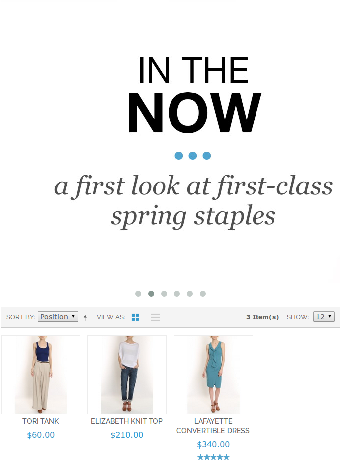
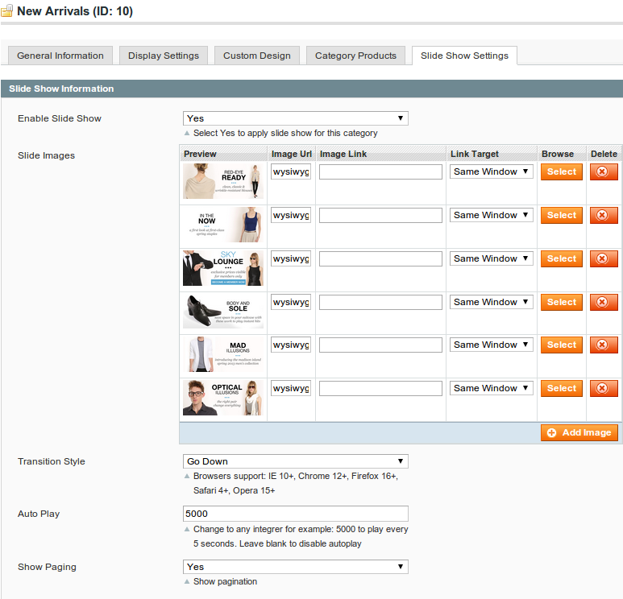
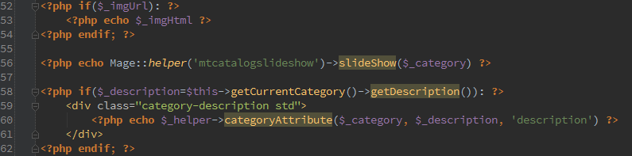

# MT Catalog Slide Show Magento Extension

## Overview

Allow config & insert a slide show into category page view

## Feauture

* Using awesome Owl Carousel software
* Intergated with Admin Catalog Management
* Very simple configuration

## Usage

### 1. Install

* Extract code & paste `app`, `js` folder to your Magento root directory

### 2. Configuration

* Logout & login Magento Admin area
* Goto `Catalog / Manage Categories`
* Choose a category want to apply slide show
* Click on tab `Slide Show Settings`
* 
* First enable slide show by change `Enable Slide Show` to `Yes`
* Click `Add image` to add a row for inser image
* Click `Browser` to select a photo
* If you want using image from Internet, paste its url into `Image Url`
* Insert link to `Image Link` and link bahavior if need
* Choose `Transition Style`. [Demo](http://www.owlgraphic.com/owlcarousel/demos/transitions.html) from Owl Carousel
* Enbale `Show Paging` if need
* Click `Save Category`

### 3. Show on frontend

* Because lack of position from default category page view, you need add slide show manualy to template. This step only need do once and effect to all category, you dont need add code again for other category.
* Access to Magento installation directory (using FTP for remote host)
* Goto `app / design / frontend / [your theme package] / [your theme] / template`
* Find file with name `view.phtml` in `catalog / category` directory. If you dont have this directory, copy it from `app / design / frontend / base / default / template / catalog / category`
* Add line `<?php echo Mage::helper('mtcatalogslideshow')->slideShow($_category) ?>` to any position you want to show, nomarlly under category image and before category description
* 
* Go to your website, open category link, it will show a nice slide show here
* Note: If you using slide show for a category, you should consider remove its Image & Description

## Bugs

* Multi language not support yet, category slide show will applied for all store view in a website

## FAQ

Send us a email to [support@magentothemes.net](mailto:support@magentothemes.net) if you has questions or improvement this extension

Feel free to take a look to our works [here](http://www.zooextension.com). Thanks!
